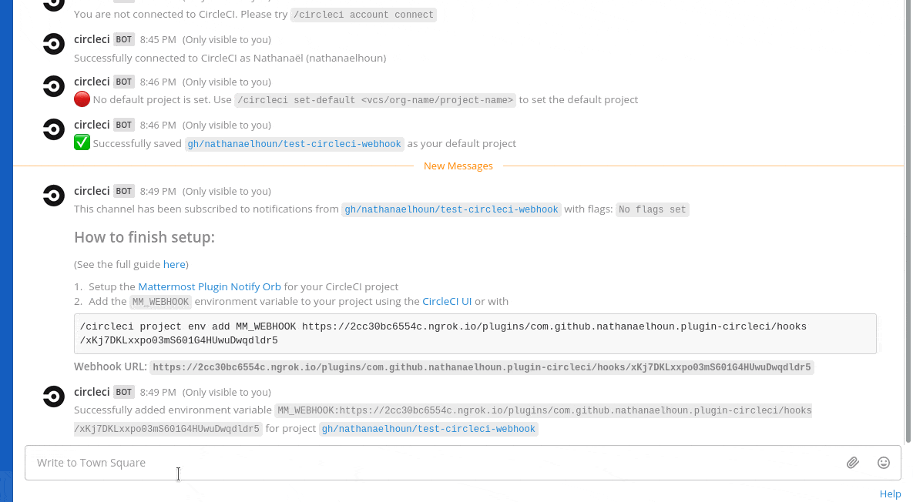
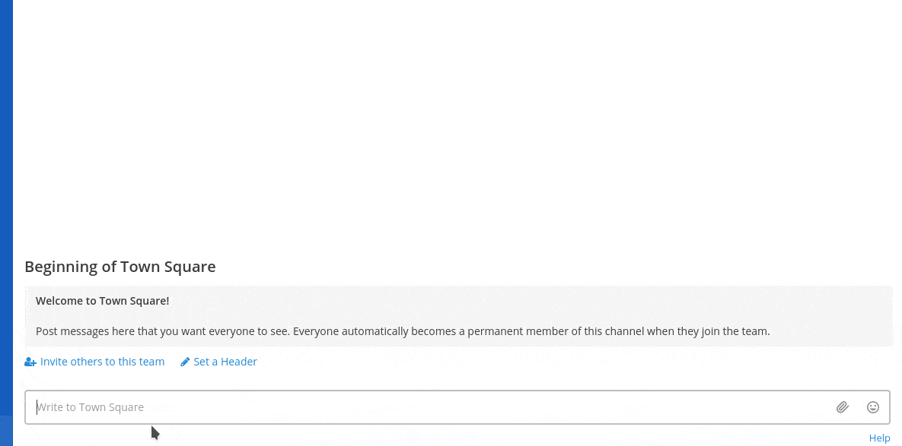

# Mattermost Plugin CircleCI

[](https://circleci.com/gh/nathanaelhoun/mattermost-plugin-circleci)
[](https://github.com/nathanaelhoun/mattermost-plugin-circleci/releases/latest)
[](https://goreportcard.com/report/github.com/nathanaelhoun/mattermost-plugin-circleci)
[](https://community.mattermost.com/core/channels/plugin-circleci)

A [Mattermost Plugin](https://developers.mattermost.com/extend/plugins/) for [CircleCI](https://circleci.com) to interact with jobs, builds or workflows and receive notifications in Mattermost channels.

This plugin uses the CircleCI Orb for Mattermost Plugin by **[@nathanaelhoun](https://github.com/nathanaelhoun)**: [check it out here](https://github.com/nathanaelhoun/circleci-orb-mattermost-plugin-notify).

## Table of Contents

-   [Audience](#audience)
-   [About the CircleCI Plugin](#about-the-circleci-plugin)
-   [Prerequisites](#prerequisites)
-   [Installation instructions](#installation-instructions)
-   [Configuration](#configuration)
-   [Onboarding Your Users](#onboarding-your-users)
-   [Slash Commands](#slash-commands)
    -   [Overview](#overview)
    -   [Subscribe to webhooks notifications](#subscribe-to-webhooks-notifications)
-   [Frequently Asked Questions](#frequently-asked-questions)
-   [Development](#development)
-   [License](#license)
-   [Contributing](#contributing)
-   [Thanks to](#thanks-to)
-   [Security Vulnerability Disclosure](#security-vulnerability-disclosure)



## Audience

This guide is intended for Mattermost System Admins setting up the CircleCI plugin and Mattermost users who want information about the plugin functionality. For more information about contributing to this plugin, visit the [Development section](#development).

## About the CircleCI Plugin

The Mattermost CircleCI plugin uses a personal API token to connect your Mattermost account to CircleCI to interact with the API.

After your System Admin has [configured the CircleCI plugin](#configuration), run `/circleci account connect` in a Mattermost channel to connect your Mattermost and CircleCI accounts.

Once connected, you'll have access to the following features:

-   **Pipeline and workflow management** - Get informations about pipelines or workflows or triggering new ones
-   **Workflows notifications** - Receive worflows notifications directly in your Mattermost channel, including their status
-   **Slash commands** - Interact with the CircleCI plugin using the `/circleci` slash command. Read more about slash commands [here](#slash-commands).

## Prerequisites

This guide assumes you have:

-   A project, hosted on github.com or bitbucket.org,
-   A CircleCI SaaS account, which has access to the projects/org you want to interact with,
-   A Mattermost server running v5.12 or higher, with a configured [Site URL](https://docs.mattermost.com/administration/config-settings.html?highlight=site%20url#site-url). v5.24 or higher is recommended to have the autocomplete feature.

## Installation instructions

1. Go to the [releases page of this Github repository](https://github.com/nathanaelhoun/mattermost-plugin-circleci/releases) and download the latest release for your Mattermost server.
2. Upload this file in the Mattermost System Console under **System Console > Plugins > Management** to install the plugin. To learn more about how to upload a plugin, [see the documentation](https://docs.mattermost.com/administration/plugins.html#plugin-uploads).
3. Activate the plugin at **System Console > Plugins > Management**.

## Configuration

### Step 1: Configure the Bot account in Mattermost

If you have an existing Mattermost user account with the name `circleci`, the plugin will post using the `circleci` account but without a `BOT` tag.

To prevent this, either:

-   Convert the `circleci` user to a bot account by running `mattermost user convert circleci --bot` in the CLI, or:
-   If the user is an existing user account you want to preserve, change its username and restart the Mattermost server. Once restarted, the plugin will create a bot account with the name `circleci`.

### Step 2: Configure the plugin in Mattermost

**Generate the keys**

Open **System Console > Plugins > CircleCI**:

-   Generate a new value for **Webhooks Secret**
-   Generate a new value for **At Rest Encryption Key**.
-   Hit **Save**.
-   Go to **System Console > Plugins > Management** and click **Enable** to enable the CircleCI plugin.

You're all set!

## Onboarding Your Users

When you’ve tested the plugin and confirmed it’s working, notify your team so they can connect their CircleCI account to Mattermost and get started. Copy and paste the text below, edit it to suit your requirements, and send it out.

> Hi team,
>
> We've set up the Mattermost CircleCI plugin, so you can get notifications from CircleCI in Mattermost. To get started, run the `/circleci account connect` slash command from any channel within Mattermost to connect your Mattermost account with CircleCI. Then, take a look at the [slash commands](#slash-commands) section for details about how to use the plugin.

## Slash Commands

### Overview

By default, the commands use the project set by `/circleci config`, unless a specific project is specified by the argument `--project <vcs/org-name/project-name>` (possible on all commands)

```
Connect to your CircleCI account:
    - /circleci account view                — Get informations about yourself
    - /circleci account connect <API token> — Connect your Mattermost account to CircleCI
    - /circleci account disconnect          — Disconnect your Mattermost account from CircleCI

Set your default project:
    - /circleci default                             — View your currently configured default project
    - /circleci default [vcs/org-name/project-name] — Set new default project by passing value in the form <vcs/org-name/project-name>

Subscribe your channel to notifications:
    - /circleci subscription list               — List the CircleCI subscriptions for the current channel
    - /circleci subscription add [--flags]      — Subscribe the current channel to CircleCI notifications for a project
    - /circleci subscription remove [--flags]   — Unsubscribe the current channel to CircleCI notifications for a project
    - /circleci subscription list-channels      — List all channels in the current team subscribed to a project

Manage pipelines:
    - /circleci pipeline trigger branch <branch>    — Trigger pipeline for a project for a given branch
    - /circleci pipeline trigger tag <tag>          — Trigger pipeline for a project for a given tag
    - /circleci pipeline workflows <pipelineID>     — Get list of workflows for given pipeline
    - /circleci pipeline recent                     — Get list of all recently ran pipelines
    - /circleci pipeline all                        — Get list of all pipelines for a project
    - /circleci pipeline mine                       — Get list of all pipelines triggered by you for a project
    - /circleci pipeline get <pipelineID>           — Get informations about a single pipeline given pipeline ID
    - /circleci pipeline get <pipelineNumber>       — Get informations about a single pipeline for a given project by passing unique pipeline number
NOTE: To get pipelineID, user can list all the pipelines(using all, recent, mine subcommands) and get the pipelineID for a particular pipeline.

Manage worflows:
    - /circleci workflow get <workflowID>       — Get information about a workflow
    - /circleci workflow jobs <workflowID>      — Get jobs list for a given workflow
    - /circleci workflow rerun <workflowID>     — Rerun a given workflow
    - /circleci workflow cancel <workflowID>    — Cancel a given workflow
NOTE: One can get the workflowID using `/circleci pipeline workflows` command

Manage CircleCI projects:
    - /circleci project list-followed           — List followed projects
    - /circleci project recent-build <branch>   — List the 10 last builds for a project
    - /circleci project env list                — List a masked environment variables for a project
    - /circleci project env add name value      — Add an environment variable for a project
    - /circleci project env remove name         — Remove an environment variable from a project
```

### Subscribe to webhooks notifications

Subscribe a channel to notifications from a CircleCI project.



#### Steps

1.  In the channel you want to subscribe to notifications, type `/circleci subscription add`.
    -   You can add the optional flag `--only-failed` to only received notifications about failed jobs
    -   You can temporarily use a project different that the one set with `/circleci config`, using the optional flag `--project <vcs/org-name/project-name>`
2.  Install the [Mattermost Plugin Notify Orb](https://circleci.com/developer/orbs/orb/nathanaelhoun/mattermost-plugin-notify) for CircleCI in your project. You usually do this by modifing the `.circleci/config.yml`.

    -   You can add the command [status](https://circleci.com/developer/orbs/orb/nathanaelhoun/mattermost-plugin-notify#usage-status) in your existing jobs to get a notification when this job is finished
    -   Or you can setup the [approval-notification](https://circleci.com/developer/orbs/orb/nathanaelhoun/mattermost-plugin-notify#jobs-approval-notification) job in a workflow to warn that you have a workflow waiting for approval.

3.  Add the webhook URL given by `/circleci subscription add` to your CircleCI project.

    -   You may add it to the orb as a parameter, but this is discouraged as it should be treated like a secret
    -   You should add it as a Environment Variable named `MM_WEBHOOK`, through the [CircleCI UI](https://circleci.com/docs/2.0/env-vars/#setting-an-environment-variable-in-a-project) or using the plugin: `/circleci project env add MM_WEBHOOK <webhook-url>`

## Frequently Asked Questions

### How does the plugin save user data for each connected CircleCI user?

CircleCI user tokens are AES encrypted with an At Rest Encryption Key configured in the plugin's settings page. Once encrypted, the tokens are saved in the `PluginKeyValueStore` table in your Mattermost database.

### How do I share feedback on this plugin?

Feel free to create a [Github Issue](https://github.com/nathanaelhoun/mattermost-plugin-circleci/issues/new/choose) or join the [CircleCI Plugin channel](https://community.mattermost.com/core/channels/plugin-circleci) on the Mattermost Community instance to discuss.

## Development

This plugin only contains a server portion. Read our documentation about the [Developer Workflow](https://developers.mattermost.com/extend/plugins/developer-workflow/) and [Developer Setup](https://developers.mattermost.com/extend/plugins/developer-setup/) for more information about developing and extending plugins.

## License

This repository is licensed under the [Apache 2.0 License](LICENSE).

## Contributing

See [`CONTRIBUTING.md`](CONTRIBUTING.md)

## Thanks to

-   **[@jszwedko](https://github.com/jszwedko)** for his [CircleCI v1 Go API](https://github.com/jszwedko/go-circleci)
-   **[@TomTucka](https://github.com/TomTucka)** and **[@darkLord19](https://github.com/darkLord19)** for this [CircleCI v2 Go API](https://github.com/darkLord19/circleci-v2)
-   [Mattermost](https://mattermost.org) for providing a good software and maintaining a great community

## Security Vulnerability Disclosure

Please report any security vulnerability to @darkLord19 or @nathanaelhoun on [Community Mattermost](https://community.mattermost.com).
