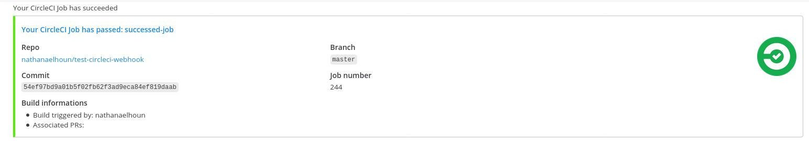

# Use the Mattermost Plugin for CircleCI

## Subscribe to webhooks notifications

Subscribe a channel to notifications from a CircleCI project.

### Requirements

-   A project hosted on Github or Bitbucket,
-   A circleCI account which can access to the project,
-   A Mattermost server with a configured [Site URL](https://docs.mattermost.com/administration/config-settings.html?highlight=site%20url#site-url).

### Steps

-   In the channel you want to subscribe to notifications, type `/circleci subscription add <org-name> <project-name>`.
-   Install the [Mattermost Plugin Notify Orb](https://circleci.com/developer/orbs/orb/nathanaelhoun/mattermost-plugin-notify) for CircleCI in your project. You usually do this by modifing the `.circleci/config.yml`.
    -   You can add the command [status](https://circleci.com/developer/orbs/orb/nathanaelhoun/mattermost-plugin-notify#usage-status) in your existing jobs to get a notification when this job is finished
    -   Or you can setup the [approval-notification](https://circleci.com/developer/orbs/orb/nathanaelhoun/mattermost-plugin-notify#jobs-approval-notification) job in a workflow to warn that you have a workflow waiting for approval.
-   Add the webhook URL given by `/circleci subscription add` to your CircleCI project.
    -   You may add it to the orb as a parameter, but this is discouraged as it should be treated like a secret
    -   You should add it as a Environment Variable named `MM_WEBHOOK`, through the [CircleCI UI](https://circleci.com/docs/2.0/env-vars/#setting-an-environment-variable-in-a-project) or using the plugin: `/circleci project env add MM_WEBHOOK <webhook-url>`

## Any information missing?

Feel free to fill a [Github Issue](https://github.com/nathanaelhoun/mattermost-plugin-circleci/issues/new/choose) and we'll add your information to this guide!
